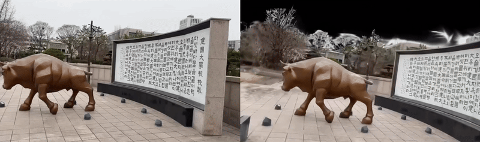
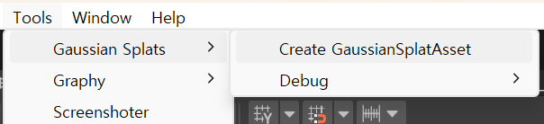
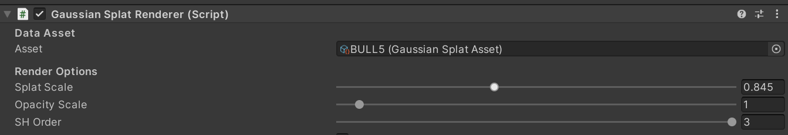
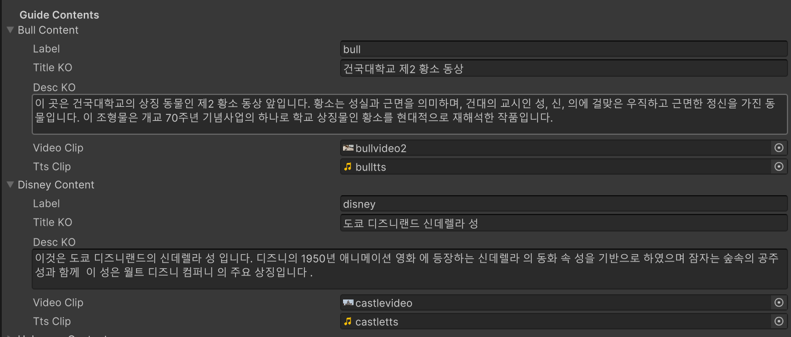

# Photorealistic VR Tour using 3D Gaussian Splatting
### 📌 Introduction

This project aims to create photorealistic VR tours by combining 3D Reconstruction (COLMAP, OpenMVS) with 3D Gaussian Splatting (3DGS), and deploying the results in Unity for VR devices (Meta Quest 3, PCVR).  
Unlike existing VR tours limited to pre-modeled spaces, our approach allows users to capture any environment with a smartphone camera and transform it into an immersive, high-quality VR tour.



### 🎯 Motivation  
Traditional VR tours are either:  
- Panoramic-based → limited to static viewing points.  
- Manually modeled in 3D engines → high cost & time-consuming.  

**Our goal**: enable fast, automated, and high-quality VR tour creation from real-world imagery while maintaining strong photorealism.

### 📋 index
- [Photorealistic VR Tour using 3D Gaussian Splatting](#photorealistic-vr-tour-using-3d-gaussian-splatting)
- [Pipeline](#pipeline)
- [Technical Requirements](#-technical-requirements)
  - [Hardware](#hardware)
  - [Software](#software)
- [Installation & Setup](#-installation--setup)
  - [Data](#1-data)
  - [Colmap](#2-colmap)
  - [3dgs](#3-3dgs)
  - [Unity](#4-unity)
- [Usage](#-usage)
  - [Quick Start](#quick-start)
  - [Output](#output)
  - [VR](#vr)
- [Future Work](#-future-work)
- [Contribution](#contribution)
- [Citation](#citation)
- [License info](#license-info)

## Pipeline

1. Image Capture → User records a short (1–3 min) video of the target environment.

2. 3D Reconstruction (COLMAP) → Sparse point clouds + camera poses.

4. 3D Gaussian Splatting (3DGS) → Optimized point cloud rendering with high realism.

5. Unity Integration → Export to VR scene, interactive with Meta Quest 3.

## 💻 Technical Requirements
### Hardware
GPU: NVIDIA RTX with ≥ 16 GB VRAM (recommended 24 GB+ for large scenes).  
CPU: 8+ cores.  
RAM: 32 GB+.  
Storage: ~100 GB free space.  
VR Device: Meta Quest 3 (PCVR recommended.  

### Software
OS: Windows 10.  
Python 3.10+ (Conda environment provided).  
CUDA 11.8+.  
Unity 2022+ with XR Interaction Toolkit.  

### Prerequisites

## 🔧 Installation & Setup


### 1. Data 
The pipeline requires image sequences as input. You can either use the provided **sample dataset** or prepare your own data from a recorded video.

### 🔹 Sample Data
To quickly test the pipeline:
- Download the provided sample dataset: *link* .
- Place it inside the `datasets/` folder.  

 
### 🔹 Custom Data
To process your own environment:

1. **Record a Video**
 - Use a smartphone or camera.  
 - Recommended: **1–3 minutes** of video while slowly walking around the target environment.  
 - Capture smooth motion with overlapping views (avoid rapid rotations).  

2. **Extract Frames**
 - Install [FFmpeg](https://ffmpeg.org/):
   - **macOS (Homebrew):**
     ```bash
     brew install ffmpeg
     ```
   - **Windows:**
     1. Download a build from [ffmpeg.org/download](https://ffmpeg.org/download.html).  
     2. Extract it and add the `bin` folder to your system PATH.  

 - Run the command to extract frames at 2–5 fps:
   	- macOS:
   ```bash
   ffmpeg -i video.mp4 -vf fps=3 frames/v_%04d.jpg
   ```
   -  Windows CMD: use backslashes instead of forward slashes:
   ```cmd
   ffmpeg -i video.mp4 -vf fps=3 frames\v_%04d.jpg
   ```
   - Adjust fps depending on:
	   - **Simple scenes** → 2 fps is enough.  
	   - **Complex/detailed scenes** → use 4–5 fps for better reconstruction.
3. **Organize Dataset**
 - Place your extracted frames into the project folder:
   ```
   datasets/<scene_name>/frames/
   ```
	
### 2. Colmap
👉 Download and install COLMAP. 
Follow the [installation guidelines](https://colmap.github.io/install.html) .

### 3. 3dgs


### 4. Unity 
version - 2022.3.47f1 


## 🚀 Usage
### 3D reconstruction:
Follow the COLMAP [tutorial](https://colmap.github.io/tutorial.html) to get started with reconstruction.
#### Step 1 — Open COLMAP
- Launch the [COLMAP GUI](https://colmap.github.io/gui.html#gui). 
#### Step 2 — Create a New Project
- Go to **File → New Project…**  
- Set:
  - **Image path:** `datasets/<scene_name>/frames/`
  - **Database path:** `datasets/<scene_name>/colmap/database.db`
  - **Project file:** (optional, e.g. `datasets/<scene_name>/colmap/project.ini`)  
- Click **Save**.
#### Step 3 — Feature Extraction
- From the top menu: **Processing → Feature Extraction…**
- Select:
  - **Camera model:** `SIMPLE_RADIAL` (recommended for smartphone video)  
  - **Single camera:** enabled  
  - **Use GPU:** if available  
- Run the extraction.
#### Step 4 — Feature Matching
- For video frames (sequential order): **Processing → Sequential Matcher…**
  - Set *Overlap* = 5–10 (controls how many neighboring frames to match).  
- For unordered photos: use **Exhaustive Matcher** instead.  
- Run the matching.
#### Step 5 — Sparse Reconstruction (Mapping)
- From the top menu: **Reconstruction → Start Reconstruction…**
- Select:
  - **Database path** = your project’s `database.db`  
  - **Image path** = `frames/`  
  - **Output path** = `datasets/<scene_name>/colmap/sparse/`  
- Click **Run**. COLMAP will create one or more models (e.g. `sparse/0`).
#### Step 6 — Save the Model for Next Step
COLMAP automatically saves the reconstruction in **binary format**, which is required for 3D Gaussian Splatting.
After reconstruction, you should export model and get the following files:
- `cameras.bin`
- `images.bin`
- `points3D.bin`

Additionally, keep your `project.ini` (created when you made the project).  
👉 These files will be used directly as input for the **3D Gaussian Splatting** stage.  

Once you have the COLMAP output (`cameras.bin`, `images.bin`, `points3D.bin`, and `project.ini`), the next step is to run the **3D Gaussian Splatting reconstruction**.  

### 3D Gaussian Splatting
#### 📁 Required Files and Folders for 3DGS

Before running the Colab notebook, organize your data in the correct folder structure inside the `gaussian-splatting` project directory.

You need two folders:

1. **`input/`**  
   - Place the **original images** (frames extracted from your video) that were used for COLMAP. 

2. **`sparse/`**  
   - Place the **COLMAP output files** here. These files describe the reconstructed scene:
     - `cameras.bin`
     - `images.bin`
     - `points3D.bin`
     - `project.ini`  

#### Step 1 — Open Colab
- Launch the provided `3dgs.ipynb` notebook in Google Colab.
- Before running any code in the notebook:
1. Go to **Runtime → Change runtime type** in Colab.  
2. Set **Hardware accelerator** = **GPU (T4)**.  
3. Enable **High-RAM** option.  
   - This ensures there is enough memory for training large point clouds.  

- Run the cells **sequentially** until you reach the code block:

```python
# 파일을 저장할 경로를 지정
file_path = "/content/gaussian-splatting/requirements.txt"
content = "plyfile=0.8.1"

# 파일 작성
with open(file_path, "w") as f:
    f.write(content)

print(f"{file_path} 에 파일을 저장하였습니다")
```

This creates a file called requirements.txt inside /content/gaussian-splatting/.

#### Step 2 — Edit ```requirements.txt```
Open the newly created requirements.txt file in Colab.

Replace its contents with the following:
```
plyfile==0.8.1
tqdm
submodules/diff-gaussian-rasterization
submodules/simple-knn
```
#### Step 3 — Continue Running the Notebook

After saving the updated requirements.txt, continue running the remaining cells.

#### 📤 Output of 3DGS

After running the Colab notebook until the end, a new folder named **`output/`** will be created inside the project directory.  
This folder contains the trained Gaussian Splatting model.
project/3dgsOutput/point_cloud/iteration_50000/point_cloud.ply

- **`point_cloud.ply`** → This is the trained Gaussian Splatting model saved in PLY format.  

### Unity

Once you have generated the `point_cloud.ply` file from 3DGS, you can load it into Unity using the provided project.

#### Step 1 — Open the Unity Project
- Open the Unity project you downloaded from GitHub.

#### Step 2 — Create a Gaussian Splat Asset
- In Unity, go to the menu: **Tools → Gaussian Splats → Create Gaussian Splat Asset**  
- In the **Input PLY File** field, drag and drop the `point_cloud.ply` file generated by 3DGS.  
- Click **Create Asset**.



#### Step 3 — Locate the Asset
- Unity will create a new asset file inside `Assets/GaussianAssets/` .
- The asset will have the same name as your `.ply` file.

#### Step 4 — Assign the Asset in the Scene
- In the scene hierarchy, find the object **`3dgsobject1`**.  
- Drag the newly created asset into its **Asset** slot.  
- If you only have one PLY file, you can **disable `3dgsobject2`**.



---

#### (Optional) Backend Integration
If you have a backend server running (for example, one that performs **object detection / KNN / image classification** using the 3DGS environment and communicates with Unity through the `CaptureAndSend` script on `127.0.0.1:8000`), you can use the following:

**Step 5 — Configure SendPhoto Object**
- In the scene hierarchy, select the **`SendPhoto`** object.  
- In the **Guide Contents** section, fill in:
- **Label** → the type of label expected from the backend  
- **Title** → title for the UI  
- **Description** → description text for the detected object  
- **Video (mp4)** → optional video clip  
- **TTS (wav)** → optional audio narration 

---

### Quick Start (With fastapi backend)
If you just want to experience the Unity project as provided:

**Step 5.5 — Set Up the Backend Server**
- Before building the Unity project, you need to start the FastAPI backend server.
  Unity will send captured photos to this server for analysis (object/scene detection).

  - Open the backend in PyCharm
    Both **main.py** and **requirements.txt** are included in this repository.
	Open main.py in PyCharm (or any Python IDE).
  - Check file paths in main.py
    Inside main.py, there are four file path definitions — for example,
	paths to models, datasets, or save directories.

	Before running, update these paths to match **your local environment**
	(e.g. absolute paths to your model files or working folders).
  - Install required modules
    Make sure you have **Python 3.9+** installed.
	Then, in the same directory where **main.py** and **requirements.txt** are located, run:
	```
	pip install -r requirements.txt --upgrade
	```

  - Run the FastAPI server
    ```
    uvicorn main:app --host 127.0.0.1 --port 8000 --reload
    ```
    If successful, you’ll see:
    ```
	INFO:     Uvicorn running on http://127.0.0.1:8000
	```
	Keep this server running while you use the Unity app —
	when you press B (Capture) in VR, Unity will send the captured image to this backend for analysis.

**Step 6 — Build the Project**
- Go to **File → Build Settings**.  
- Choose your platform (**Windows / Mac / Linux**).  
- Click **Build**.

**Step 7 — Run in VR (PCVR Mode)**
- Connect your HMD (e.g., Meta Quest 3 in PCVR mode).  
- Launch the built Unity app.

**Step 8 — Controls**
- **Left XR Controller**  
- Joystick → Move forward, backward, left, right  
- **Y button** → Switch to another virtual space (useful if you have multiple PLY assets)  
- **Right XR Controller**  
- Joystick left/right → Rotate view  
- **A button** → Create camera  
- **B button** → Capture photo and send it to backend (if configured)

**Step 9 — UI Feedback**
- When sending a photo, a **"Analyzing…"** UI appears.  
- After a short wait, a UI with the description of the detected object/space is displayed.

### Output: 
### VR:

## 🔮 Future Work

## Contribution
## Citation
## License info

👥 Team  **"RealityOne"**  
조석현 (202011371)  
최지야 (202213586)  
하라다카호 (202213528)  


