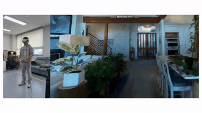
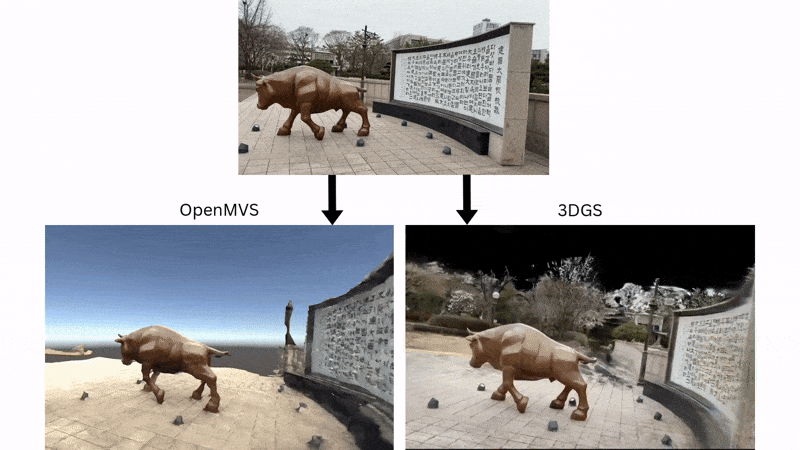
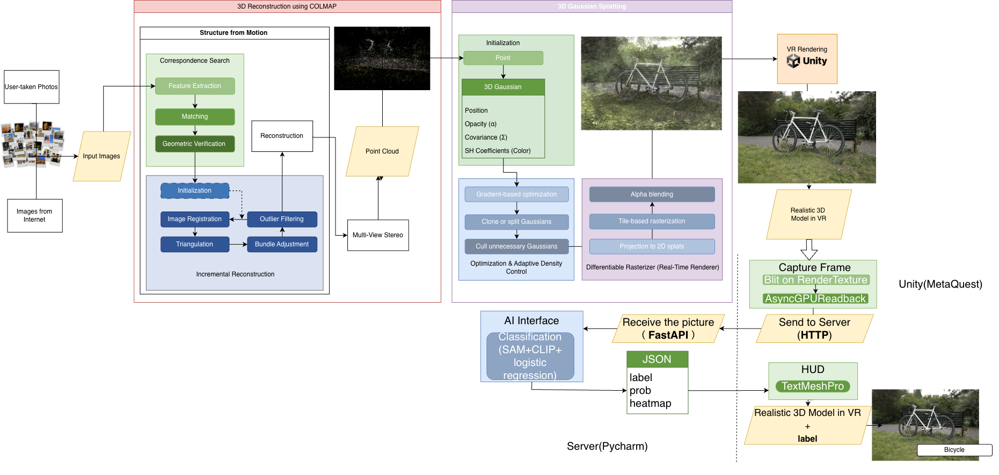

# Photorealistic VR Tour using 3D Gaussian Splatting
### 📌 Introduction

This project aims to create photorealistic VR tours by combining 3D Reconstruction (COLMAP, OpenMVS) with 3D Gaussian Splatting (3DGS), and deploying the results in Unity for VR devices (Meta Quest 3, PCVR).  
Unlike existing VR tours limited to pre-modeled spaces, our approach allows users to capture any environment with a smartphone camera and transform it into an immersive, high-quality VR tour.




### 🎯 Motivation  
Traditional VR tours are either:  
- Panoramic-based → limited to static viewing points.  
- Manually modeled in 3D engines → high cost & time-consuming.  

**Our goal**: enable fast, automated, and high-quality VR tour creation from real-world imagery while maintaining strong photorealism.

### 📋 Index
- [Motivation](#-motivation)
- [Pipeline](#pipeline)
- [Technical Requirements](#-technical-requirements)
  - [Hardware](#hardware)
  - [Software](#software)
- [Full Installation Guide](./INSTALLATION.md)
- [Quick Start](#quick-start)
- [Output](#output)
- [Future Work](#-future-work)
- [Contribution](#contribution)
- [Citation](#citation)
- [License info](#license-info)

## Pipeline

1. Image Capture → User records a short (1–3 min) video of the target environment.

2. 3D Reconstruction (COLMAP) → Sparse point clouds + camera poses.

3. 3D Gaussian Splatting (3DGS) → Optimized point cloud rendering with high realism.

4. Unity Integration → Export to VR scene, interactive with Meta Quest 3.



## 💻 Technical Requirements
### Hardware
GPU: NVIDIA RTX ≥ 16 GB VRAM (24 GB+ recommended for large scenes)  
CPU: 8+ cores   
RAM: 32 GB+  
Storage: ~100 GB free space  
VR Device: Meta Quest 3 (PCVR recommended  

### Software  
- OS: Windows 10  
- Python 3.10+  
- CUDA 11.8+  
- Unity 2022.3.5f1 ~ 2022.3.47f1
- XR Interaction Toolkit  
- Meta Horizon App (required for Meta Quest Link / AirLink connection)  

## 📥 How to Download This Repository (Git LFS Required)

> ⚠️ Important  
> This project uses large binary assets (e.g., Gaussian Splat models, textures).  
> **Do not** use the “Download ZIP” button on GitHub — some files will be missing or corrupted.

Instead, clone the repository using **Git LFS**:

1. Install Git LFS  
   - Download from: https://git-lfs.com/  
   - On Windows, run: `git-lfs-windows-v3.7.1.exe`

2. Open **Command Prompt** and run:

   ```bash
   git clone https://github.com/seokhyun0303/Photorealistic-VR-Tour-with-3D-Gaussian-Splatting
   cd Photorealistic-VR-Tour-with-3D-Gaussian-Splatting
   git lfs pull
	```
3. In Unity Hub, choose Add project from disk and select this cloned folder.

 ## 🔧 Installation & Setup
For full data preparation, COLMAP reconstruction, 3D Gaussian Splatting training, and Unity import steps, see the detailed guide:

➡️ [Full Installation & Setup Guide](./INSTALLATION.md)
---

## Quick Start 
(With FastAPI Backend)

If you want to experience the Unity project with backend features such as photo capture, scene analysis, and object recognition, follow the steps below.

This backend supports both:

- **Scene 1 — VR Tour:** object/environment detection  
- **Scene 2 — Interior / Shopping Scene:** contextual interior analysis and item recognition  

---

## Set Up the Backend Server (FastAPI)

This project contains two completely separate backend servers, and each server corresponds to a different Unity scene:

### 🛒 1. IKEA URL Finder Backend (Interior / Shopping Scene)

When the user takes a virtual photo in the interior shopping scene, this backend analyzes the captured image and returns the closest matching IKEA product.  
→ Backend code is already included inside the GitHub repository (shopping_script.zip)  
→ The IKEA URL Finder backend requires a stable Internet connection to access the IKEA API and OpenAI API.  
**Konkuk University Wi-Fi may block external API traffic**, so if the backend does not respond, please switch to a different network (e.g., hotspot, home Wi-Fi).

🔧 How to Set Up the IKEA Backend

**Step 1** — Open PyCharm, create a new empty Python project.

**Step 2** — Copy the backend files

After cloning the GitHub project with Git LFS copy the following 4 files into your new Python project:

- caption_image.py
- clip_similarity.py
- ikea_client.py
- main.py

**Step 3** — Install required packages

In PyCharm terminal:
```
pip install uvicorn
pip install torch
pip install fastapi
pip install openai
pip install ikea_api
pip install open_clip_torch
pip install requests
pip install python-multipart
```

**Step 4** — Set OpenAI API key

PyCharm terminal:
```
$env:OPENAI_API_KEY="YOUR_API_KEY"
```

**Step 5** — Run the backend
```
uvicorn main:app --host 0.0.0.0 --port 8000 --reload
```

If you see:
```
INFO:     Application startup complete.
```

the backend is running successfully.

### 🐂 2. Bull Statue Detection Backend (Tour Scene)

This backend processes captured photos in the tour scene, detecting and giving a discription of the objects captured.
→ Backend files are NOT in GitHub (must be downloaded separately)

🔧 How to Set Up the Bull Detection Backend

**Step 1** — Open PyCharm, create a new Python project.

**Step 2** — Download backend package

Download this [zip](https://drive.google.com/file/d/19fcQzbZMJccmCbrENV32U5k4odxzbFLi/view?usp=sharing).

Unzip photodetect.zip and copy everything into your project:

- sam_vit_h_4b8939.pth
- requirements.txt
- app/
- bull_model_out/
- disney_model_out/
- detect_out/

**Step 3** — Install requirements
```
pip install -r requirements.txt --upgrade
```

**Step 4** — Run the backend
```
uvicorn app.main:app --host 0.0.0.0 --port 8000 --reload
```
Look for:
```
INFO:     Application startup complete.
```

📌 Additional Notes  
✔ These two backends are completely independent

- You do not run them together.

- Use the backend that matches the scene you are playing.

### Output:

## 1️⃣ VR Tour Scene — Photorealistic 3D Reconstruction + Object/Scene Detection
With this pipeline, a user can reconstruct a photorealistic 3D scene from just a short video recording.

The result is a 3D Gaussian Splatting model (.ply), which can be imported into Unity and explored in VR with Meta Quest 3 (PCVR).

Unlike traditional mesh/texture reconstructions, 3DGS produces smoother surfaces and more natural colors, delivering a highly realistic experience.

When the backend server is connected, the VR system supports photo capture, object detection, and interactive guide generation — allowing users to receive contextual descriptions, videos, or audio narration directly inside the virtual tour.


## 2️⃣ Interior Shopping Scene — Virtual Camera + IKEA Product Similarity Search

The second workflow demonstrates how this pipeline can be used for an AI-powered VR shopping experience.

When the user takes a photo with the **virtual camera** (A to create camera, B to capture):

- Unity sends the captured image to the backend.  
- The backend extracts visual features. 
- It compares the embedding to IKEA’s online catalog.  
- The most visually similar furniture item is selected and returned.

Unity then displays the recommended product inside VR.

**Result:**  
Users can explore a virtual interior, photograph objects, and instantly receive **real-world IKEA product matches**, enabling:

- VR shopping  
- Interior design assistance  
- Smart room scanning applications  


## 🔮 Future Work
Interactive VR Tours: Enhance user immersion by allowing interactions such as AI-generated guide signs, contextual descriptions, or 3D mini-maps within the reconstructed scenes.

AI-Assisted Content Generation: Automate the creation of guide sign content, TTS narration, and contextual feedback to make VR tours more adaptive and immersive.

Latency Reduction: Shorten UI response times by leveraging GPU acceleration and optimizing backend communication.


## Contribution
## Citation
This project makes use of the following open-source software:
- [Unity-VR-Gaussian-Splatting](https://github.com/ninjamode/Unity-VR-Gaussian-Splatting)
- [COLMAP](https://colmap.github.io/) — Schönberger, J. L., & Frahm, J.-M. (2016). Structure-from-Motion Revisited. CVPR.
## License info
- Unity-VR-Gaussian-Splatting → MIT License © 2023 ninjamode
- COLMAP → BSD 3-Clause License © 2016 Johannes L. Schönberger
(Copies of the above licenses are included in their respective repositories. This project respects and complies with those licenses.)

👥 Team  **"RealityOne"**  
조석현 (202011371)  
최지야 (202213586)  
하라다카호 (202213528)  


