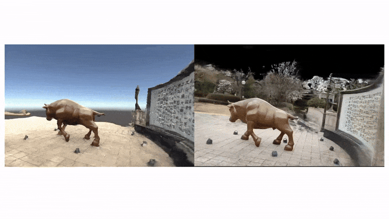

# Photorealistic VR Tour using 3D Gaussian Splatting
### 📌 Introduction

This project aims to create photorealistic VR tours by combining 3D Reconstruction (COLMAP, OpenMVS) with 3D Gaussian Splatting (3DGS), and deploying the results in Unity for VR devices (Meta Quest 3, PCVR).  
Unlike existing VR tours limited to pre-modeled spaces, our approach allows users to capture any environment with a smartphone camera and transform it into an immersive, high-quality VR tour.



### 🎯 Motivation  
Traditional VR tours are either:  
- Panoramic-based → limited to static viewing points.  
- Manually modeled in 3D engines → high cost & time-consuming.  

**Our goal**: enable fast, automated, and high-quality VR tour creation from real-world imagery while maintaining strong photorealism.

### 📋 Index
- [Motivation](#-motivation)
- [Pipeline](#pipeline)
- [Technical Requirements](#-technical-requirements)
  - [Hardware](#hardware)
  - [Software](#software)
- [Full Installation Guide](./INSTALLATION.md)
- [Unity Setup](#unity-setup)
- [Quick Start](#quick-start)
- [Output](#output)
- [Future Work](#-future-work)
- [Contribution](#contribution)
- [Citation](#citation)
- [License info](#license-info)

## Pipeline

1. Image Capture → User records a short (1–3 min) video of the target environment.

2. 3D Reconstruction (COLMAP) → Sparse point clouds + camera poses.

4. 3D Gaussian Splatting (3DGS) → Optimized point cloud rendering with high realism.

5. Unity Integration → Export to VR scene, interactive with Meta Quest 3.

## 💻 Technical Requirements
### Hardware
GPU: NVIDIA RTX ≥ 16 GB VRAM (24 GB+ recommended for large scenes)  
CPU: 8+ cores   
RAM: 32 GB+  
Storage: ~100 GB free space  
VR Device: Meta Quest 3 (PCVR recommended  

### Software  
- OS: Windows 10  
- Python 3.10+  
- CUDA 11.8+  
- Unity 2022.3.5f1 ~ 2022.3.47f1
- XR Interaction Toolkit  
- Meta Horizon App (required for Meta Quest Link / AirLink connection)  

### ⚠️ Important — GitHub Download Warning
When downloading this project as a ZIP:

❗ GitHub long path names can cause extract failures on Windows.  
✔ **Before unzipping**, rename the ZIP file to a **short name**.


 ## 🔧 Installation & Setup
For full data preparation, COLMAP reconstruction, 3D Gaussian Splatting training, and Unity import steps, see the detailed guide:

➡️ [Full Installation & Setup Guide](./INSTALLATION.md)


### Unity Setup

#### Step 1 — Open the Unity Project
- Open the Unity project you downloaded from GitHub.

#### Step 2 — Create a Gaussian Splat Asset
- In Unity, go to the menu: **Tools → Gaussian Splats → Create Gaussian Splat Asset**  
- In the **Input PLY File** field, drag and drop the `point_cloud.ply` file generated by 3DGS.  
- Click **Create Asset**.


#### Step 3 — Locate the Asset
- Unity will create a new asset file inside `Assets/GaussianAssets/` .
- The asset will have the same name as your `.ply` file.

#### Step 4 — Assign the Asset in the Scene
- In the scene hierarchy, find the object **`3dgsobject1`**.  
- Drag the newly created asset into its **Asset** slot.  
- If you only have one PLY file, you can **disable `3dgsobject2`**.


---

#### (Optional) Backend Integration
If you have a backend server running (for example, one that performs **object detection / KNN / image classification** using the 3DGS environment and communicates with Unity through the `CaptureAndSend` script on `127.0.0.1:8000`), you can use the following:

**Step 5 — Configure SendPhoto Object**
- In the scene hierarchy, select the **`SendPhoto`** object.  
- In the **Guide Contents** section, fill in:
- **Label** → the type of label expected from the backend  
- **Title** → title for the UI  
- **Description** → description text for the detected object  
- **Video (mp4)** → optional video clip  
- **TTS (wav)** → optional audio narration 

---

## Quick Start 
(With FastAPI Backend)

If you want to experience the Unity project with backend features such as photo capture, scene analysis, and object recognition, follow the steps below.

This backend supports both:

- **Scene 1 — VR Tour:** object/environment detection  
- **Scene 2 — Interior / Shopping Scene:** contextual interior analysis and item recognition  

---

## Set Up the Backend Server (FastAPI)

### 1. Download the Backend Files

Backend files (including `main.py` and required assets) can be downloaded [here](https://drive.google.com/file/d/19fcQzbZMJccmCbrENV32U5k4odxzbFLi/view?usp=sharing):

Unzip the folder and open it in **PyCharm**, **VSCode**, or any Python IDE.

---

### 2. Update Paths in `main.py`

Inside `main.py`, several environment variables and file paths must be updated:

```
MODEL_LABEL = os.getenv("MODEL_LABEL", "황소상")
OUT_DIR     = os.getenv("OUT_DIR", "/workspace/bull_model_out")
SAM_CKPT    = os.getenv("SAM_CKPT", "/workspace/sam_vit_h_4b8939.pth")  
```

Change these paths to match your local file locations:
		- SAM model checkpoint path
		- Prototype output directory
		- Any dataset or working folders
Use absolute paths to avoid runtime errors.

Make sure you have **Python 3.9+** installed.
	
Then, in the same directory where **main.py** and **requirements.txt** are located, run:

```
pip install -r requirements.txt --upgrade
```

### 🔑 Set OpenAI API Key (Windows PowerShell)

```powershell
$env:OPENAI_API_KEY="YOUR_OPENAI_KEY_HERE"
```

Replace "YOUR_OPENAI_KEY_HERE" with your actual API key.

### 3. Run the FastAPI server

Start the server using:

```
uvicorn main:app --host 127.0.0.1 --port 8000 --reload
```

If successful, you’ll see:

```
INFO:     Uvicorn running on http://127.0.0.1:8000
```

Keep this server running while you use the Unity app.


**Step 6 — Build the Project in Unity**
- Go to **File → Build Settings**.  
- Choose your platform (**Windows / Mac / Linux**).  
- Click **Build**.

**Step 7 — Run in VR (PCVR Mode)**
- Connect Meta Quest 3 via Link / AirLink
- Launch the built Unity application

**Step 8 — Controls**
- **Left XR Controller**  
- Joystick → Move forward, backward, left, right  
- **Y button** → Switch to another virtual space (useful if you have multiple PLY assets)  
- **Right XR Controller**  
- Joystick left/right → Rotate view  
- **A button** → Create camera  
- **B button** → Capture photo and send it to backend (if configured)

**Step 9 — UI Feedback**
- When sending a photo, a **"Analyzing…"** UI appears.  
- After a short wait, a UI with the description of the detected object/space is displayed.

### Output:

## 1️⃣ VR Tour Scene — Photorealistic 3D Reconstruction + Object/Scene Detection
With this pipeline, a user can reconstruct a photorealistic 3D scene from just a short video recording.

The result is a 3D Gaussian Splatting model (.ply), which can be imported into Unity and explored in VR with Meta Quest 3 (PCVR).

Unlike traditional mesh/texture reconstructions, 3DGS produces smoother surfaces and more natural colors, delivering a highly realistic experience.

When the backend server is connected, the VR system supports photo capture, object detection, and interactive guide generation — allowing users to receive contextual descriptions, videos, or audio narration directly inside the virtual tour.


## 2️⃣ Interior Shopping Scene — Virtual Camera + IKEA Product Similarity Search

The second workflow demonstrates how this pipeline can be used for an AI-powered VR shopping experience.

When the user takes a photo with the **virtual camera** (A to create camera, B to capture):

- Unity sends the captured image to the backend.  
- The backend extracts visual features. 
- It compares the embedding to IKEA’s online catalog.  
- The most visually similar furniture item is selected and returned.

Unity then displays the recommended product inside VR.

**Result:**  
Users can explore a virtual interior, photograph objects, and instantly receive **real-world IKEA product matches**, enabling:

- VR shopping  
- Interior design assistance  
- Smart room scanning applications  


## 🔮 Future Work
Interactive VR Tours: Enhance user immersion by allowing interactions such as AI-generated guide signs, contextual descriptions, or 3D mini-maps within the reconstructed scenes.

AI-Assisted Content Generation: Automate the creation of guide sign content, TTS narration, and contextual feedback to make VR tours more adaptive and immersive.

Latency Reduction: Shorten UI response times by leveraging GPU acceleration and optimizing backend communication.


## Contribution
## Citation
This project makes use of the following open-source software:
- [Unity-VR-Gaussian-Splatting](https://github.com/ninjamode/Unity-VR-Gaussian-Splatting)
- [COLMAP](https://colmap.github.io/) — Schönberger, J. L., & Frahm, J.-M. (2016). Structure-from-Motion Revisited. CVPR.
## License info
- Unity-VR-Gaussian-Splatting → MIT License © 2023 ninjamode
- COLMAP → BSD 3-Clause License © 2016 Johannes L. Schönberger
(Copies of the above licenses are included in their respective repositories. This project respects and complies with those licenses.)

👥 Team  **"RealityOne"**  
조석현 (202011371)  
최지야 (202213586)  
하라다카호 (202213528)  


